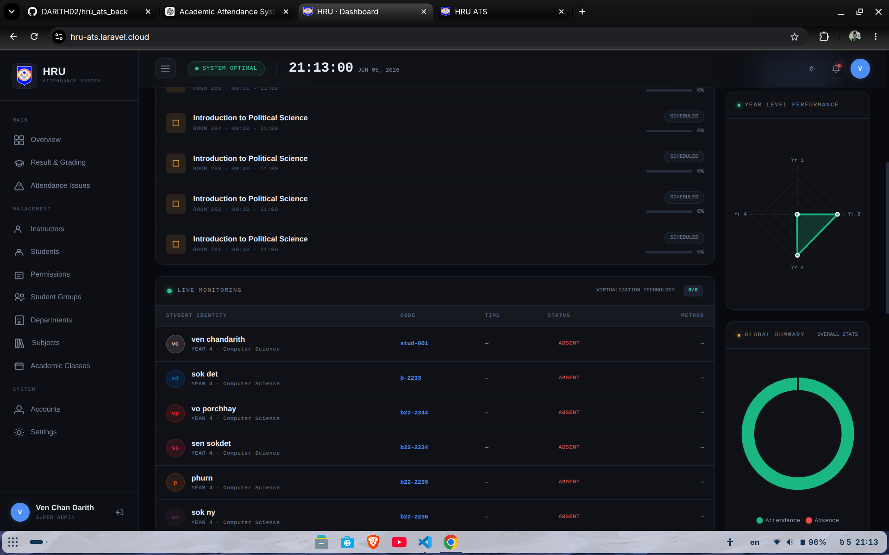
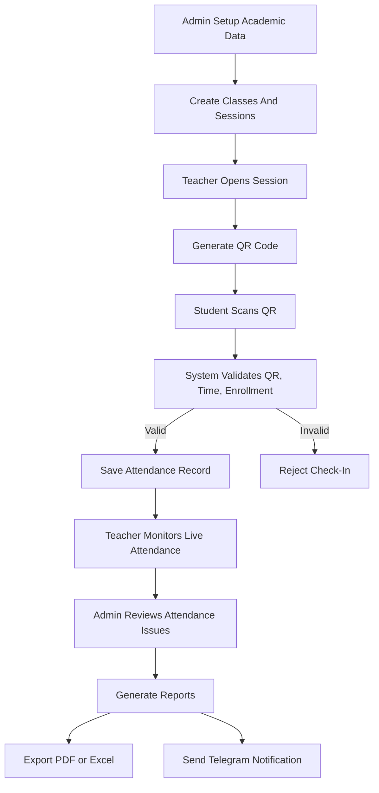
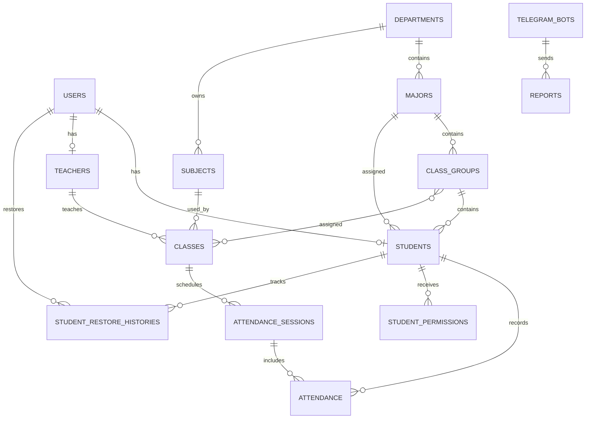
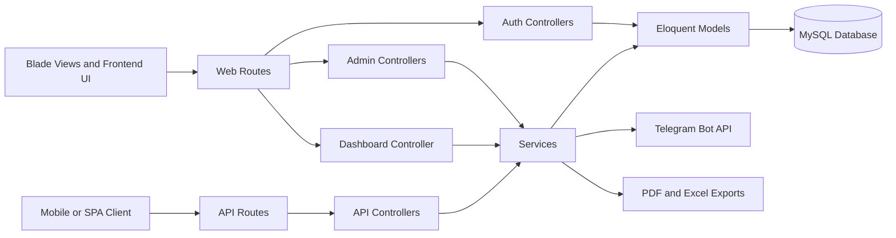
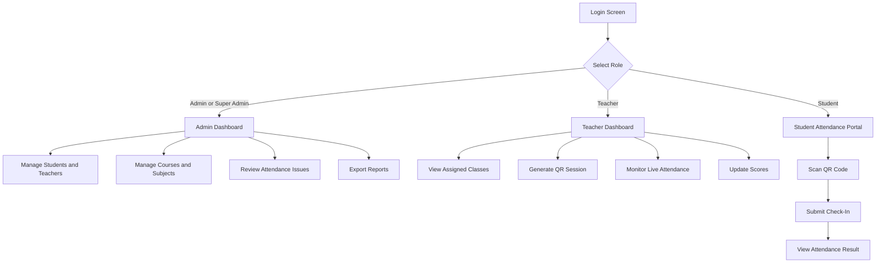

# Academic Attendance Management System


## Project Overview


The Academic Attendance Management System is a thesis project for managing university attendance, academic records, teacher activities, semester scores, reports, and administrative workflows in one digital platform.

The system replaces manual attendance checking with a web-based workflow using QR code check-in, teacher-managed attendance sessions, role-based access control, attendance issue monitoring, report exports, and Telegram notifications.

This project is designed for academic institutions that need a reliable way to track attendance, reduce manual paperwork, identify students with attendance problems, and produce useful reports for teachers and administrators.

## Project Objectives

- Build a centralized digital platform for managing academic attendance.
- Replace paper-based or manual attendance checking with QR code verification.
- Help teachers create sessions, generate QR codes, monitor live attendance, and manage scores.
- Help admins manage students, instructors, subjects, classes, departments, majors, groups, permissions, and reports.
- Detect at-risk and blacklisted students based on absence totals.
- Generate PDF and Excel reports for attendance, semester results, and academic summaries.
- Improve data security using login authentication, role-based access control, and protected API routes.
- Support Telegram notifications for reports and attendance-related updates.

## ទិដ្ឋភាពទូទៅគម្រោង

ប្រព័ន្ធគ្រប់គ្រងវត្តមានសិក្សា គឺជាគម្រោងសារណាសម្រាប់គ្រប់គ្រងវត្តមានសិស្ស កំណត់ត្រាសិក្សា សកម្មភាពគ្រូបង្រៀន ពិន្ទុប្រចាំឆមាស របាយការណ៍ និងការងាររដ្ឋបាលក្នុងប្រព័ន្ធឌីជីថលតែមួយ។

ប្រព័ន្ធនេះជំនួសការត្រួតពិនិត្យវត្តមានដោយដៃ ដោយប្រើ QR code, ការគ្រប់គ្រងសម័យវត្តមានដោយគ្រូ, ការគ្រប់គ្រងសិទ្ធិតាមតួនាទី, ការតាមដានបញ្ហាវត្តមាន, ការនាំចេញរបាយការណ៍ និងការជូនដំណឹងតាម Telegram។

គម្រោងនេះត្រូវបានរចនាឡើងសម្រាប់ស្ថាប័នសិក្សាដែលត្រូវការវិធីសាស្ត្រដែលអាចទុកចិត្តបានក្នុងការតាមដានវត្តមាន កាត់បន្ថយការងារក្រដាស រកឃើញសិស្សដែលមានបញ្ហាវត្តមាន និងបង្កើតរបាយការណ៍សម្រាប់គ្រូ និងអ្នកគ្រប់គ្រង។

## គោលបំណងគម្រោង

- បង្កើតប្រព័ន្ធឌីជីថលមជ្ឈមណ្ឌលសម្រាប់គ្រប់គ្រងវត្តមានសិក្សា។
- ជំនួសការចុះវត្តមានដោយក្រដាស ឬដោយដៃ ដោយប្រើ QR code verification។
- ជួយគ្រូបង្កើត session បង្កើត QR code តាមដានវត្តមានផ្ទាល់ និងគ្រប់គ្រងពិន្ទុ។
- ជួយ Admin គ្រប់គ្រងសិស្ស គ្រូ មុខវិជ្ជា ថ្នាក់ ដេប៉ាតឺម៉ង់ ជំនាញ ក្រុម សិទ្ធិ និងរបាយការណ៍។
- រកឃើញសិស្ស at-risk និង blacklisted តាមចំនួនអវត្តមាន។
- បង្កើតរបាយការណ៍ PDF និង Excel សម្រាប់វត្តមាន លទ្ធផលឆមាស និងសេចក្តីសង្ខេបសិក្សា។
- បង្កើនសុវត្ថិភាពទិន្នន័យដោយប្រើ login authentication, role-based access control និង protected API routes។
- គាំទ្រការជូនដំណឹងតាម Telegram សម្រាប់របាយការណ៍ និងព័ត៌មានទាក់ទងនឹងវត្តមាន។

## System Preview



## Main Modules

- **Admin Management** - manage students, instructors, subjects, classes, departments, majors, groups, permissions, settings, and reports.
- **Teacher Portal** - manage assigned classes, generate QR codes, monitor live attendance, update session status, and manage scores.
- **Student Attendance** - scan QR codes, verify attendance, and access attendance data.
- **Attendance Issues** - detect at-risk and blacklisted students based on accumulated absences.
- **Reports And Exports** - generate PDF and Excel reports for attendance, semester scores, and institutional summaries.
- **Telegram Integration** - send attendance and report notifications through configured Telegram bots.

## Demo Account

Use the **Try demo system** button on the login page to open a ready admin demo workspace. Demo mode is read-only, so reviewers can explore modules without changing project data. The app creates or updates this account automatically for review:

- **Email:** demo@example.com
- **Password:** demo123
- **Role:** Approved admin

## ម៉ូឌុលសំខាន់ៗ

- **ការគ្រប់គ្រង Admin** - គ្រប់គ្រងសិស្ស គ្រូ មុខវិជ្ជា ថ្នាក់ ដេប៉ាតឺម៉ង់ ជំនាញ ក្រុម សិទ្ធិ ការកំណត់ និងរបាយការណ៍។
- **ផ្នែកគ្រូបង្រៀន** - គ្រប់គ្រងថ្នាក់ដែលបានចាត់តាំង បង្កើត QR code តាមដានវត្តមានផ្ទាល់ កែប្រែស្ថានភាពសម័យ និងគ្រប់គ្រងពិន្ទុ។
- **វត្តមានសិស្ស** - ស្កេន QR code ផ្ទៀងផ្ទាត់វត្តមាន និងមើលទិន្នន័យវត្តមាន។
- **បញ្ហាវត្តមាន** - រកឃើញសិស្សដែលមានហានិភ័យ ឬត្រូវបាន blacklist តាមចំនួនអវត្តមាន។
- **របាយការណ៍ និងការនាំចេញ** - បង្កើត PDF និង Excel សម្រាប់វត្តមាន ពិន្ទុឆមាស និងរបាយការណ៍សរុប។
- **Telegram Integration** - ផ្ញើការជូនដំណឹង និងរបាយការណ៍តាម Telegram bot។

## Work Flow

1. **Admin prepares academic data** - create departments, majors, class groups, subjects, teachers, students, and class schedules.
2. **Teacher runs attendance session** - open assigned class, generate QR code, monitor check-ins, and complete the session.
3. **Student checks in** - scan QR code, submit attendance request, and receive attendance status.
4. **System validates attendance** - verify QR token, student enrollment, time window, attendance status, and optional location.
5. **Admin reviews results** - monitor dashboard, attendance issues, at-risk students, blacklisted students, and semester results.
6. **Reports are generated** - export attendance, semester result, subject score, and institutional summary reports as PDF or Excel.
7. **Notifications are sent** - send report summaries or documents through Telegram bot integration.

## លំហូរការងារ

1. **Admin រៀបចំទិន្នន័យសិក្សា** - បង្កើតដេប៉ាតឺម៉ង់ ជំនាញ ក្រុមថ្នាក់ មុខវិជ្ជា គ្រូ សិស្ស និងកាលវិភាគថ្នាក់។
2. **Teacher ដំណើរការ session វត្តមាន** - បើកថ្នាក់ដែលបានចាត់តាំង បង្កើត QR code តាមដាន check-in និងបញ្ចប់ session។
3. **Student ចុះវត្តមាន** - ស្កេន QR code ផ្ញើ attendance request និងទទួលស្ថានភាពវត្តមាន។
4. **ប្រព័ន្ធផ្ទៀងផ្ទាត់វត្តមាន** - ពិនិត្យ QR token, student enrollment, time window, attendance status និង location ជាជម្រើស។
5. **Admin ពិនិត្យលទ្ធផល** - តាមដាន dashboard, attendance issues, at-risk students, blacklisted students និង semester results។
6. **បង្កើតរបាយការណ៍** - នាំចេញ attendance, semester result, subject score និង institutional summary ជា PDF ឬ Excel។
7. **ផ្ញើការជូនដំណឹង** - ផ្ញើសេចក្តីសង្ខេប ឬឯកសាររបាយការណ៍តាម Telegram bot។

## Project Flow Diagram



## Database Relationship Diagram



## Code Architecture Diagram



## UI/UX Flow Diagram



## Full Project Documentation

This README is the short project presentation. For the full thesis-style description, including objectives, problem statement, scope, methodology, system architecture, detailed step-by-step workflow, technology stack, setup, security notes, and English/Khmer documentation, open:

**[Read Full Project Documentation](docs/README.md)**

For teammate presentations and technical speaking notes, use:

**[Technical Presentation Guide](docs/TECHNICAL_PRESENTATION_GUIDE.md)**

## ឯកសារពេញលេញ

README នេះជាការបង្ហាញគម្រោងខ្លី។ សម្រាប់អានការពិពណ៌នាគម្រោងពេញលេញបែបសារណា រួមមានគោលបំណង បញ្ហាដែលត្រូវដោះស្រាយ ដែនកំណត់ វិធីសាស្ត្រ ស្ថាបត្យកម្មប្រព័ន្ធ លំហូរការងារលម្អិតជាជំហានៗ បច្ចេកវិទ្យា ការដំឡើង កំណត់ចំណាំសុវត្ថិភាព និងឯកសារជាភាសាអង់គ្លេស/ខ្មែរ សូមចុច:

**[អានឯកសារគម្រោងពេញលេញ](docs/README.md)**

## Technology Stack

- Laravel 12
- PHP 8.2+
- MySQL
- Redis
- Nginx
- Docker Compose
- Laravel Sanctum
- Blade templates
- Vite
- JavaScript
- Maatwebsite Excel
- DomPDF
- Cloudinary
- Telegram Bot API

## Quick Start

```bash
docker compose up -d --build
docker compose exec app php artisan migrate --force
docker compose exec app php artisan config:cache
docker compose exec app php artisan view:cache
```

Local application:

```text
http://localhost:8080
```

Useful local URLs:

```text
Login:      http://localhost:8080/login
Register:   http://localhost:8080/register
phpMyAdmin: http://localhost:8082
```

## Authentication Pages

The login and register pages use the same responsive two-panel UI style with HRU ATS branding, language switching, and mobile-friendly layouts.

- **Login page:** `/login`
- **Register page:** `/register`
- **Demo account action:** shown on the login page when demo login is enabled.
- **Register action:** shown on the login page when public registration is enabled.
- **Language support:** English and Khmer translations are stored in `resources/lang/en/auth.php` and `resources/lang/km/auth.php`.
- **Dynamic branding:** login/register read `app_name`, `app_sub`, `institution_name`, and `app_logo` from the `settings` table.

## Environment Flags

Important `.env` flags:

```env
APP_DEBUG=false
PUBLIC_REGISTRATION_ENABLED=true
DEMO_LOGIN_ENABLED=true
ALLOW_STUDENT_CODE_LOGIN=false
```

Recommended production values:

```env
APP_DEBUG=false
PUBLIC_REGISTRATION_ENABLED=false
DEMO_LOGIN_ENABLED=false
```

When changing `.env`, refresh cached config:

```bash
docker compose exec app php artisan config:clear
docker compose exec app php artisan config:cache
```

## Demo Account

When `DEMO_LOGIN_ENABLED=true`, the login page shows **View demo account**. Clicking it signs in to a demo admin workspace.

The app creates or updates the demo account automatically:

- **Email:** `demo@example.com`
- **Password:** `demo123`
- **Role:** Approved admin

Disable this in production by setting:

```env
DEMO_LOGIN_ENABLED=false
```

## Registration

When `PUBLIC_REGISTRATION_ENABLED=true`, the login page shows the **Create one** action and `/register` is available.

Newly registered admin accounts are pending approval unless the correct super admin key is provided.

Disable public registration in production by setting:

```env
PUBLIC_REGISTRATION_ENABLED=false
```

## Security Notes

Current security controls include:

- `APP_DEBUG=false` production check.
- Public registration controlled by `PUBLIC_REGISTRATION_ENABLED`.
- Demo login controlled by `DEMO_LOGIN_ENABLED`.
- Login/register/demo route rate limits.
- Admin/role middleware on protected areas.
- Request validation for auth and admin actions.
- Security headers middleware and Nginx headers.
- Student permission audit logs for assign/revoke actions.
- Backup readiness check with `php artisan backup:check`.

Run security and backup readiness check:

```bash
docker compose exec app php artisan backup:check
```

## Docker Services

The local Docker stack includes:

- `app` - Laravel application with Nginx/PHP
- `queue` - Laravel queue worker
- `scheduler` - Laravel scheduler worker
- `mysql` - MySQL database
- `redis` - Redis cache
- `phpmyadmin` - database administration UI

Check service status:

```bash
docker compose ps
```
