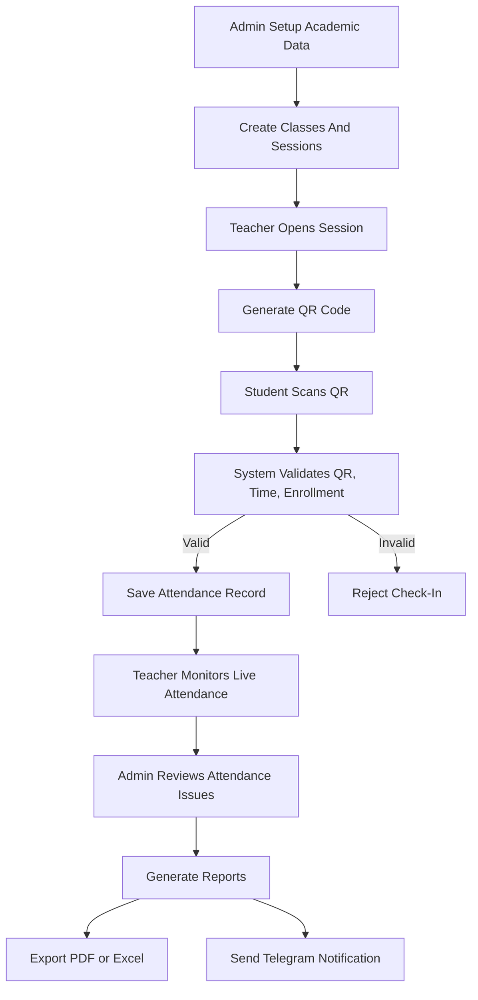
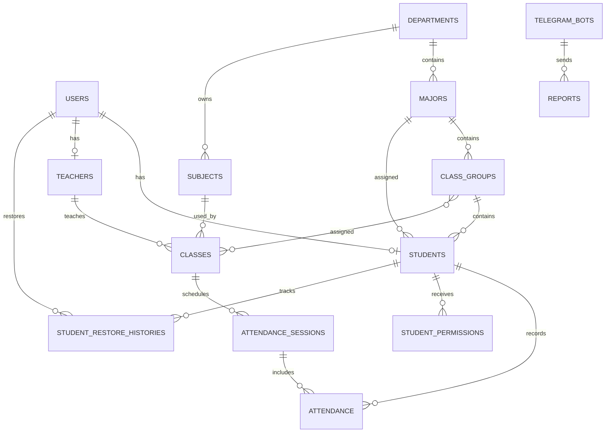
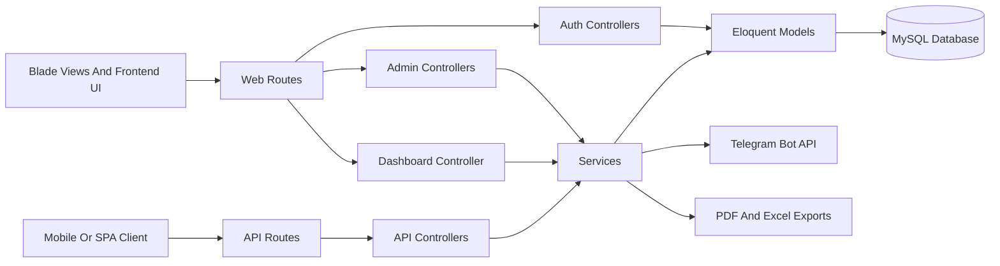
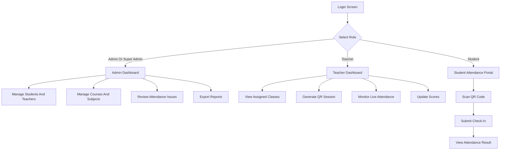

# Full Project Documentation


## Thesis Project Overview


**Project Title:** Academic Attendance Management System  
**Project Type:** Thesis / Final Year System Project  
**Institution Context:** University academic attendance and administration  
**System Category:** Web-based attendance, academic management, reporting, and notification system  
**Main Technology:** Laravel, PHP, MySQL, Redis, Nginx, Docker, Blade, JavaScript  

This document describes the full project system for the Academic Attendance Management System. It explains the background, problem statement, objectives, scope, features, workflow, database concept, system architecture, UI/UX flow, technology stack, setup steps, security notes, limitations, and conclusion. The document is written in both English and Khmer for thesis presentation and repository documentation.

## Project Visual Summary

### System Dashboard


### Project Team


### Supervisor


### Project Leader


### Telegram Notification Example


## Thesis Abstract

The Academic Attendance Management System is developed to solve common problems in manual university attendance management. Traditional attendance tracking often depends on paper forms, teacher memory, or spreadsheets, which can cause delays, inaccurate records, duplicated data, and difficulty producing semester reports.

This project provides a digital attendance workflow using QR code verification, teacher-managed sessions, student check-in, admin monitoring, attendance issue detection, semester score tracking, PDF and Excel exports, and Telegram notifications. The system uses role-based access control so that Super Admins, Admins, Teachers, and Students can only access the features related to their responsibilities.

The final result is a centralized platform that improves attendance accuracy, reduces manual work, supports academic reporting, helps identify at-risk students earlier, and provides better operational visibility for academic administrators.

## សេចក្តីសង្ខេបសារណា

ប្រព័ន្ធគ្រប់គ្រងវត្តមានសិក្សា ត្រូវបានបង្កើតឡើងដើម្បីដោះស្រាយបញ្ហាទូទៅនៃការគ្រប់គ្រងវត្តមានដោយដៃក្នុងសាកលវិទ្យាល័យ។ វិធីសាស្ត្រចាស់ៗដូចជា ក្រដាសចុះវត្តមាន ការហៅឈ្មោះ ឬការកត់ត្រាក្នុង spreadsheet អាចធ្វើឱ្យយឺត មានកំហុស ទិន្នន័យស្ទួន និងពិបាកបង្កើតរបាយការណ៍ប្រចាំឆមាស។

គម្រោងនេះផ្តល់លំហូរការងារឌីជីថលដោយប្រើ QR code verification, teacher-managed sessions, student check-in, admin monitoring, attendance issue detection, semester score tracking, PDF/Excel exports និង Telegram notifications។ ប្រព័ន្ធប្រើ role-based access control ដើម្បីធានាថា Super Admin, Admin, Teacher និង Student អាចប្រើបានតែ feature ដែលពាក់ព័ន្ធនឹងតួនាទីរបស់ខ្លួន។

លទ្ធផលចុងក្រោយគឺជាប្រព័ន្ធមជ្ឈមណ្ឌលដែលជួយបង្កើនភាពត្រឹមត្រូវនៃវត្តមាន កាត់បន្ថយការងារដោយដៃ គាំទ្ររបាយការណ៍សិក្សា រកឃើញសិស្សដែលមានហានិភ័យបានលឿន និងផ្តល់ភាពច្បាស់លាស់សម្រាប់ការគ្រប់គ្រងរដ្ឋបាលសិក្សា។

## Keywords

- Academic Attendance
- QR Code Check-In
- Laravel System
- Role-Based Access Control
- Student Management
- Teacher Portal
- Semester Score
- Attendance Report
- Telegram Notification
- Thesis Project

## ពាក្យគន្លឹះ

- វត្តមានសិក្សា
- ការចុះវត្តមានតាម QR Code
- ប្រព័ន្ធ Laravel
- ការគ្រប់គ្រងសិទ្ធិតាមតួនាទី
- ការគ្រប់គ្រងសិស្ស
- ផ្នែកគ្រូបង្រៀន
- ពិន្ទុឆមាស
- របាយការណ៍វត្តមាន
- ការជូនដំណឹងតាម Telegram
- គម្រោងសារណា

## Project Identity

| Item | Description |
| --- | --- |
| Project Name | Academic Attendance Management System |
| Purpose | Manage attendance, academic records, reports, and notifications |
| Main Users | Super Admin, Admin, Teacher, Student |
| Main Output | Attendance records, semester scores, reports, blacklist/restore history |
| Deployment Type | Laravel web application with Docker support |
| Documentation | English and Khmer thesis-style project documentation |

## អត្តសញ្ញាណគម្រោង

| ចំណុច | ការពិពណ៌នា |
| --- | --- |
| ឈ្មោះគម្រោង | ប្រព័ន្ធគ្រប់គ្រងវត្តមានសិក្សា |
| គោលបំណង | គ្រប់គ្រងវត្តមាន កំណត់ត្រាសិក្សា របាយការណ៍ និងការជូនដំណឹង |
| អ្នកប្រើសំខាន់ | Super Admin, Admin, Teacher, Student |
| លទ្ធផលសំខាន់ | កំណត់ត្រាវត្តមាន ពិន្ទុឆមាស របាយការណ៍ ប្រវត្តិ blacklist/restore |
| ប្រភេទ Deploy | Laravel web application ដែលគាំទ្រ Docker |
| ឯកសារ | ឯកសារគម្រោងបែបសារណា ជាភាសាអង់គ្លេស និងខ្មែរ |

## Repository Entry Point

The root [README.md](../README.md) provides the short project presentation with quick overview, images, workflow, and diagrams. This file contains the full detailed thesis documentation.

## ចំណុចចូល Repository

[README.md](../README.md) នៅ root ផ្តល់ការបង្ហាញគម្រោងខ្លី រួមមាន overview, images, workflow និង diagrams។ ឯកសារនេះជាឯកសារលម្អិតពេញលេញសម្រាប់សារណា។

## English Version

### Thesis Project Title

**Academic Attendance Management System**

### Project Description

The Academic Attendance Management System is a Laravel-based web application designed to improve how a university manages student attendance, teacher activities, class sessions, semester scoring, administrative data, and academic reports.

The system digitizes attendance workflows by using QR code check-in, teacher-managed attendance sessions, admin monitoring, role-based access control, automated attendance issue detection, PDF and Excel exports, and Telegram notification support.


### Problem Statement

Many academic institutions still depend on manual attendance methods such as paper sheets, verbal checking, or spreadsheet updates. These methods can be slow, inaccurate, difficult to audit, and hard to use for semester reports.

The main problems addressed by this project are:

- Manual attendance consumes class time.
- Attendance records can be lost, duplicated, or modified without clear tracking.
- Teachers and administrators need better visibility into student attendance.
- Students with frequent absences are difficult to detect early.
- Semester reports and score calculations require repeated manual work.
- Communication through reports and notifications is often delayed.

### Project Objectives

- Build a centralized attendance management platform for academic use.
- Allow teachers to create and monitor QR-based attendance sessions.
- Allow students to verify attendance through QR scanning.
- Allow admins to manage students, instructors, classes, subjects, departments, majors, and groups.
- Detect students with high absence counts and classify them as at-risk or blacklisted.
- Generate attendance, score, and institutional reports.
- Improve data security with authentication, authorization, and role-based access.
- Support Telegram notifications for reports and attendance-related alerts.

### Scope Of The System

The system supports four main user groups:

- **Super Admin** - approves users, manages high-impact records, deletes restricted data, and controls major administrative actions.
- **Admin** - manages academic records, students, instructors, classes, subjects, reports, settings, and attendance issues.
- **Teacher** - manages assigned classes, QR sessions, attendance records, student scores, and subject reports.
- **Student** - uses QR-based attendance check-in and accesses attendance information.

### Main Features

#### Authentication And Authorization

- Web login and API login.
- Laravel Sanctum token authentication.
- Role-based middleware for `admin`, `super_admin`, and `teacher`.
- Admin approval workflow for non-student users.
- Optional student-code login controlled by `ALLOW_STUDENT_CODE_LOGIN`.

#### Attendance Management

- QR code attendance verification.
- Dynamic QR token regeneration.
- Check-in time window validation.
- Optional campus location validation.
- Manual teacher check-in.
- Attendance status tracking: present, late, absent, excused, scheduled, completed, and skipped.
- Live attendance monitoring for teachers.

#### Academic Management

- Student management.
- Instructor management.
- Course and class management.
- Subject management.
- Department, major, and class group management.
- Semester assignment and academic period management.
- Student permission management for excused cases.

#### Attendance Issue Monitoring

- Tracks absence totals by academic year and semester.
- Detects students with 10-29 absences as at-risk.
- Detects students with 30 or more absences as blacklisted.
- Tracks restore history and blacklist events.
- Supports PDF report export and Telegram report sending.

#### Semester Scores And Reports

- Teacher score entry.
- Admin semester result review.
- Attendance, midterm, assignment, final, and total score breakdowns.
- Semester report PDF generation.
- Subject score exports.
- Attendance issue reports.
- Institutional summary exports.

#### Telegram Integration

- Store Telegram bot settings.
- Activate one Telegram bot.
- Send test notifications.
- Send attendance and result reports.
- Sync Telegram chat IDs from bot updates.

### System Workflow

The system workflow is divided into setup, daily attendance operation, monitoring, reporting, and notification steps.

#### Step 1: System Login And Role Access

1. The user opens the web application.
2. The user enters login credentials.
3. The system checks the account credentials.
4. The system checks the user's role.
5. The user is redirected to the correct dashboard:
   - Super Admin dashboard
   - Admin dashboard
   - Teacher dashboard
   - Student attendance interface
6. Protected pages and API routes are limited by role middleware.

#### Step 2: Academic Structure Setup

1. Admin creates departments.
2. Admin creates majors under each department.
3. Admin creates class groups such as year level or cohort groups.
4. Admin creates subjects.
5. Admin creates instructor accounts.
6. Admin creates student accounts.
7. Admin assigns each student to a major and class group.
8. Admin confirms that student information, phone, email, status, and student code are correct.

#### Step 3: Class And Semester Setup

1. Admin creates a class or course.
2. Admin assigns a subject to the class.
3. Admin assigns a teacher to the class.
4. Admin assigns one or more class groups to the class.
5. Admin sets academic year and semester.
6. Admin sets class schedule, start time, end time, and session information.
7. The system stores the class and session records in the database.
8. The teacher can now see the assigned class in the teacher portal.

#### Step 4: Attendance Session Workflow

1. Teacher opens the assigned class.
2. Teacher selects or starts an attendance session.
3. The system verifies that the teacher owns that class/session.
4. Teacher generates a QR code.
5. The system creates a secure QR token for the active session.
6. Students scan the QR code from the classroom.
7. The student attendance request is sent to the backend.
8. The system validates:
   - QR token
   - student identity
   - student class or group enrollment
   - check-in time window
   - optional location rule
9. If valid, the attendance record is saved as present or late.
10. If invalid, the system rejects the check-in request.

#### Step 5: Teacher Monitoring Workflow

1. Teacher views the live attendance feed.
2. The system shows checked-in students.
3. Teacher can manually check in a student when needed.
4. Teacher can update session status.
5. Teacher can regenerate the QR code if the old QR should no longer be used.
6. Teacher reviews present, late, absent, and excused records.
7. Teacher closes or completes the session.

#### Step 6: Attendance Issue Monitoring Workflow

1. Admin opens the attendance issue page.
2. Admin selects academic year and semester.
3. The system calculates completed sessions for each student's group.
4. The system counts attendance records for each student.
5. The system checks excused permissions.
6. The system calculates total absences.
7. Students with 10-29 absences are marked as at-risk.
8. Students with 30 or more absences are marked as blacklisted.
9. Admin can manually blacklist a student if needed.
10. Admin or Super Admin can restore a student when a valid reason is provided.
11. The system records blacklist and restore history.

#### Step 7: Semester Score Workflow

1. Teacher opens semester score management.
2. Teacher selects the assigned subject or class.
3. Teacher enters attendance score, midterm score, assignment score, final score, and teacher score.
4. The system calculates total score.
5. Admin reviews semester results.
6. Admin can preview final reports.
7. Reports can be exported for academic records.

#### Step 8: Report And Export Workflow

1. Admin opens a report page.
2. Admin selects filters such as academic year, semester, class, subject, or student.
3. The system prepares the report data.
4. Admin exports data as PDF or Excel.
5. Reports can include:
   - student list
   - instructor list
   - attendance records
   - attendance issue report
   - semester result report
   - subject score report
   - institutional summary report
6. The exported file can be stored, printed, or sent to stakeholders.

#### Step 9: Telegram Notification Workflow

1. Admin configures a Telegram bot.
2. Admin activates the bot.
3. Admin syncs or enters the Telegram chat ID.
4. Admin sends a test notification.
5. When a report is ready, Admin sends the report to Telegram.
6. The system sends the message or document through the Telegram Bot API.
7. The recipient receives the report in Telegram.

#### Step 10: Security And Maintenance Workflow

1. Admin keeps user roles updated.
2. Super Admin approves or removes admin-level users.
3. Production secrets are stored in `.env`.
4. Cache is cleared after configuration changes.
5. Migrations are run after deployment.
6. Dependencies are reviewed with Composer and NPM audit commands.
7. MySQL and phpMyAdmin are kept private in production.

### System Architecture

The project follows a Laravel MVC architecture:

- **Routes** define web and API endpoints.
- **Controllers** handle requests and coordinate business logic.
- **Models** represent database entities through Eloquent ORM.
- **Services** contain reusable logic for attendance scoring and Telegram communication.
- **Blade Views** render admin, teacher, student, and PDF pages.
- **Migrations** define and update the database schema.
- **Docker** provides a local development environment with PHP, Nginx, MySQL, and Redis.

### System Diagrams

#### Project Flow Diagram



#### Database Relationship Diagram



#### Code Architecture Diagram



#### UI/UX Flow Diagram



### Technology Stack

- Laravel 12
- PHP 8.2+
- MySQL
- Redis
- Nginx
- Docker Compose
- Laravel Sanctum
- Blade templates
- Vite
- JavaScript
- Maatwebsite Excel
- DomPDF
- Cloudinary
- Telegram Bot API

### Project Structure

- `app/Http/Controllers/Api` - API controllers for auth, admin, teacher, attendance, and location features.
- `app/Http/Controllers/Admin` - Web admin UI controllers.
- `app/Http/Controllers/Auth` - Web authentication controllers.
- `app/Models` - Eloquent models for users, students, teachers, classes, attendance, settings, Telegram bots, and academic entities.
- `app/Services` - Business logic for attendance scoring, attendance processing, and Telegram notifications.
- `database/migrations` - Database schema definitions.
- `database/seeders` - Initial data seeders.
- `resources/views` - Blade UI pages and PDF templates.
- `routes/web.php` - Web routes.
- `routes/api.php` - API routes.
- `docker-compose.yml` - Local Docker environment.
- `Dockerfile` and `start.sh` - Container build and startup process.

### Screenshots And Assets

#### University Building


#### Dashboard


#### Telegram Notification


#### Project Team


#### Supervisor


#### Leader


### Local Setup

Start the local Docker environment:

```bash
docker compose up -d --build
```

Run database migrations:

```bash
docker compose exec app php artisan migrate --force
```

Clear Laravel cache:

```bash
docker compose exec app php artisan optimize:clear
```

Application URL:

```text
http://localhost:8080
```

phpMyAdmin URL:

```text
http://localhost:8081
```

### Security Notes

- Do not commit real `.env` secrets.
- Set `APP_DEBUG=false` in production.
- Use a strong `APP_KEY`.
- Rotate exposed database, Cloudinary, Telegram, and admin credentials.
- Keep `ALLOW_STUDENT_CODE_LOGIN=false` in production unless a temporary migration period is required.
- Do not expose MySQL or phpMyAdmin publicly in production.
- Run `composer audit --locked` and `npm audit --omit=dev` before deployment.

### Current Limitations

- Imported students receive generated passwords and need a complete onboarding or password reset flow.
- Some public student endpoints should be reviewed before public deployment.
- Full automated tests are limited and should be expanded.
- Docker Compose exposes MySQL and phpMyAdmin for local development and should be hardened for production.

### Conclusion

This project provides a complete digital attendance management workflow for an academic institution. It improves attendance accuracy, reduces manual work, supports teacher and admin operations, helps identify attendance issues earlier, and provides report generation for academic decision-making.

---

## កំណែភាសាខ្មែរ

### ចំណងជើងគម្រោងសារណា

**ប្រព័ន្ធគ្រប់គ្រងវត្តមានសិក្សា**

### ការពិពណ៌នាគម្រោង

ប្រព័ន្ធគ្រប់គ្រងវត្តមានសិក្សា គឺជាកម្មវិធី Web ដែលបង្កើតដោយ Laravel សម្រាប់ជួយសាកលវិទ្យាល័យគ្រប់គ្រងវត្តមានសិស្ស សកម្មភាពគ្រូបង្រៀន សម័យថ្នាក់ ពិន្ទុប្រចាំឆមាស ទិន្នន័យរដ្ឋបាល និងរបាយការណ៍សិក្សា។

ប្រព័ន្ធនេះបម្លែងលំហូរការងារវត្តមានពីការធ្វើដោយដៃទៅជាប្រព័ន្ធឌីជីថល ដោយប្រើ QR code check-in, ការគ្រប់គ្រងសម័យវត្តមានដោយគ្រូ, ការតាមដានដោយ Admin, ការគ្រប់គ្រងសិទ្ធិតាមតួនាទី, ការរកឃើញបញ្ហាវត្តមាន, ការនាំចេញ PDF/Excel និងការជូនដំណឹងតាម Telegram។

### បញ្ហាដែលត្រូវដោះស្រាយ

ស្ថាប័នសិក្សាជាច្រើននៅតែប្រើវិធីសាស្ត្រត្រួតពិនិត្យវត្តមានដោយដៃ ដូចជា ក្រដាសចុះវត្តមាន ការហៅឈ្មោះ ឬការកត់ត្រាក្នុង spreadsheet។ វិធីទាំងនេះអាចយឺត មានកំហុស ពិបាកត្រួតពិនិត្យ និងពិបាកបង្កើតរបាយការណ៍។

បញ្ហាសំខាន់ៗដែលគម្រោងនេះដោះស្រាយមាន:

- ការចុះវត្តមានដោយដៃចំណាយពេលក្នុងថ្នាក់។
- កំណត់ត្រាវត្តមានអាចបាត់ ស្ទួន ឬត្រូវបានកែដោយគ្មានប្រវត្តិច្បាស់លាស់។
- គ្រូ និង Admin ត្រូវការមើលស្ថានភាពវត្តមានឱ្យបានច្បាស់។
- ពិបាករកឃើញសិស្សដែលអវត្តមានញឹកញាប់មុនពេលយឺត។
- ការបង្កើតរបាយការណ៍ និងគណនាពិន្ទុឆមាសត្រូវធ្វើការងារដដែលៗ។
- ការផ្ញើព័ត៌មាន និងរបាយការណ៍អាចយឺត។

### គោលបំណងគម្រោង

- បង្កើតប្រព័ន្ធមជ្ឈមណ្ឌលសម្រាប់គ្រប់គ្រងវត្តមានសិក្សា។
- អនុញ្ញាតឱ្យគ្រូបង្កើត និងតាមដានសម័យវត្តមានតាម QR code។
- អនុញ្ញាតឱ្យសិស្សបញ្ជាក់វត្តមានដោយស្កេន QR code។
- អនុញ្ញាតឱ្យ Admin គ្រប់គ្រងសិស្ស គ្រូ ថ្នាក់ មុខវិជ្ជា ដេប៉ាតឺម៉ង់ ជំនាញ និងក្រុម។
- រកឃើញសិស្សដែលមានចំនួនអវត្តមានខ្ពស់ និងចាត់ថ្នាក់ជា at-risk ឬ blacklisted។
- បង្កើតរបាយការណ៍វត្តមាន ពិន្ទុ និងរបាយការណ៍ស្ថាប័ន។
- បង្កើនសុវត្ថិភាពទិន្នន័យដោយ authentication, authorization និង role-based access។
- គាំទ្រការជូនដំណឹងតាម Telegram សម្រាប់របាយការណ៍ និងការជូនដំណឹងផ្សេងៗ។

### ដែនកំណត់ប្រព័ន្ធ

ប្រព័ន្ធគាំទ្រអ្នកប្រើប្រាស់សំខាន់ៗ ៤ ប្រភេទ:

- **Super Admin** - អនុម័តអ្នកប្រើ គ្រប់គ្រងទិន្នន័យសំខាន់ លុបទិន្នន័យដែលមានសិទ្ធិខ្ពស់ និងគ្រប់គ្រងសកម្មភាពរដ្ឋបាលសំខាន់ៗ។
- **Admin** - គ្រប់គ្រងកំណត់ត្រាសិក្សា សិស្ស គ្រូ ថ្នាក់ មុខវិជ្ជា របាយការណ៍ ការកំណត់ និងបញ្ហាវត្តមាន។
- **Teacher** - គ្រប់គ្រងថ្នាក់ដែលបានចាត់តាំង សម័យ QR កំណត់ត្រាវត្តមាន ពិន្ទុសិស្ស និងរបាយការណ៍មុខវិជ្ជា។
- **Student** - ចុះវត្តមានតាម QR code និងមើលព័ត៌មានវត្តមាន។

### មុខងារសំខាន់ៗ

#### Authentication និង Authorization

- ចូលប្រើតាម Web និង API។
- ប្រើ Laravel Sanctum សម្រាប់ token authentication។
- Role-based middleware សម្រាប់ `admin`, `super_admin`, និង `teacher`។
- លំហូរអនុម័តគណនីសម្រាប់អ្នកប្រើដែលមិនមែនសិស្ស។
- Student-code login ជាជម្រើស ដែលគ្រប់គ្រងដោយ `ALLOW_STUDENT_CODE_LOGIN`។

#### ការគ្រប់គ្រងវត្តមាន

- ផ្ទៀងផ្ទាត់វត្តមានតាម QR code។
- បង្កើត QR token ថ្មី។
- ពិនិត្យពេលវេលាអនុញ្ញាតឱ្យ check-in។
- គាំទ្រការផ្ទៀងផ្ទាត់ទីតាំង campus ជាជម្រើស។
- គ្រូអាច check-in សិស្សដោយដៃ។
- តាមដានស្ថានភាពវត្តមាន: present, late, absent, excused, scheduled, completed និង skipped។
- គ្រូអាចតាមដានវត្តមានផ្ទាល់។

#### ការគ្រប់គ្រងសិក្សា

- គ្រប់គ្រងសិស្ស។
- គ្រប់គ្រងគ្រូបង្រៀន។
- គ្រប់គ្រងវគ្គសិក្សា និងថ្នាក់។
- គ្រប់គ្រងមុខវិជ្ជា។
- គ្រប់គ្រងដេប៉ាតឺម៉ង់ ជំនាញ និងក្រុមថ្នាក់។
- គ្រប់គ្រង semester assignment និង academic period។
- គ្រប់គ្រងការអនុញ្ញាតសិស្សសម្រាប់ករណី excused។

#### ការតាមដានបញ្ហាវត្តមាន

- តាមដានចំនួនអវត្តមានតាម academic year និង semester។
- ចាត់ទុកសិស្សដែលអវត្តមាន 10-29 ដងជា at-risk។
- ចាត់ទុកសិស្សដែលអវត្តមាន 30 ដងឡើងទៅជា blacklisted។
- រក្សាប្រវត្តិ restore និង blacklist event។
- គាំទ្រការនាំចេញ PDF និងការផ្ញើរបាយការណ៍តាម Telegram។

#### ពិន្ទុឆមាស និងរបាយការណ៍

- គ្រូបញ្ចូលពិន្ទុ។
- Admin ពិនិត្យលទ្ធផលឆមាស។
- បង្ហាញពិន្ទុ attendance, midterm, assignment, final និង total។
- បង្កើត semester report ជា PDF។
- នាំចេញ subject score។
- បង្កើត attendance issue report។
- នាំចេញ institutional summary។

### លំហូរការងារប្រព័ន្ធ

លំហូរការងាររបស់ប្រព័ន្ធត្រូវបានបែងចែកជា ការរៀបចំទិន្នន័យ ការចុះវត្តមានប្រចាំថ្ងៃ ការតាមដាន ការបង្កើតរបាយការណ៍ និងការជូនដំណឹង។

#### ជំហានទី 1: ចូលប្រើប្រព័ន្ធ និងសិទ្ធិតាមតួនាទី

1. អ្នកប្រើបើក web application។
2. អ្នកប្រើបញ្ចូល credential សម្រាប់ login។
3. ប្រព័ន្ធពិនិត្យ credential របស់គណនី។
4. ប្រព័ន្ធពិនិត្យ role របស់អ្នកប្រើ។
5. ប្រព័ន្ធបញ្ជូនអ្នកប្រើទៅ dashboard ត្រឹមត្រូវ:
   - Super Admin dashboard
   - Admin dashboard
   - Teacher dashboard
   - Student attendance interface
6. ទំព័រ និង API ដែលត្រូវការសុវត្ថិភាព ត្រូវបានកំណត់ដោយ role middleware។

#### ជំហានទី 2: រៀបចំរចនាសម្ព័ន្ធសិក្សា

1. Admin បង្កើត department។
2. Admin បង្កើត major នៅក្រោម department។
3. Admin បង្កើត class group ដូចជា year level ឬ cohort។
4. Admin បង្កើត subject។
5. Admin បង្កើតគណនី instructor។
6. Admin បង្កើតគណនី student។
7. Admin ចាត់តាំង student ទៅ major និង class group។
8. Admin ពិនិត្យព័ត៌មានសិស្ស ដូចជា phone, email, status និង student code។

#### ជំហានទី 3: រៀបចំថ្នាក់ និងឆមាស

1. Admin បង្កើត class ឬ course។
2. Admin ចាត់តាំង subject ទៅ class។
3. Admin ចាត់តាំង teacher ទៅ class។
4. Admin ចាត់តាំង class group មួយ ឬច្រើនទៅ class។
5. Admin កំណត់ academic year និង semester។
6. Admin កំណត់ schedule, start time, end time និង session information។
7. ប្រព័ន្ធរក្សាទុក class និង session records ក្នុង database។
8. Teacher អាចមើល class ដែលបានចាត់តាំងក្នុង teacher portal។

#### ជំហានទី 4: លំហូរការងារ Attendance Session

1. Teacher បើក class ដែលបានចាត់តាំង។
2. Teacher ជ្រើស ឬចាប់ផ្តើម attendance session។
3. ប្រព័ន្ធពិនិត្យថា teacher មានសិទ្ធិលើ class/session នោះ។
4. Teacher បង្កើត QR code។
5. ប្រព័ន្ធបង្កើត secure QR token សម្រាប់ active session។
6. Student ស្កេន QR code ពីក្នុងថ្នាក់។
7. Attendance request របស់ student ត្រូវបានផ្ញើទៅ backend។
8. ប្រព័ន្ធពិនិត្យ:
   - QR token
   - student identity
   - student class ឬ group enrollment
   - check-in time window
   - optional location rule
9. ប្រសិនបើត្រឹមត្រូវ ប្រព័ន្ធរក្សាទុកវត្តមានជា present ឬ late។
10. ប្រសិនបើមិនត្រឹមត្រូវ ប្រព័ន្ធបដិសេធ check-in request។

#### ជំហានទី 5: លំហូរការងារតាមដានរបស់គ្រូ

1. Teacher មើល live attendance feed។
2. ប្រព័ន្ធបង្ហាញសិស្សដែលបាន check-in។
3. Teacher អាច manual check-in សិស្សនៅពេលចាំបាច់។
4. Teacher អាចកែស្ថានភាព session។
5. Teacher អាច regenerate QR code ប្រសិនបើ QR ចាស់មិនគួរប្រើទៀត។
6. Teacher ពិនិត្យ records ប្រភេទ present, late, absent និង excused។
7. Teacher បិទ ឬ complete session។

#### ជំហានទី 6: លំហូរការងារតាមដានបញ្ហាវត្តមាន

1. Admin បើក attendance issue page។
2. Admin ជ្រើស academic year និង semester។
3. ប្រព័ន្ធគណនា completed sessions សម្រាប់ group របស់សិស្សនីមួយៗ។
4. ប្រព័ន្ធរាប់ attendance records របស់សិស្សនីមួយៗ។
5. ប្រព័ន្ធពិនិត្យ excused permissions។
6. ប្រព័ន្ធគណនាចំនួនអវត្តមានសរុប។
7. សិស្សដែលអវត្តមាន 10-29 ដង ត្រូវបានចាត់ជា at-risk។
8. សិស្សដែលអវត្តមាន 30 ដង ឬច្រើនជាងនេះ ត្រូវបានចាត់ជា blacklisted។
9. Admin អាច manual blacklist សិស្សប្រសិនបើចាំបាច់។
10. Admin ឬ Super Admin អាច restore សិស្សនៅពេលមានហេតុផលត្រឹមត្រូវ។
11. ប្រព័ន្ធរក្សាប្រវត្តិ blacklist និង restore។

#### ជំហានទី 7: លំហូរការងារពិន្ទុឆមាស

1. Teacher បើក semester score management។
2. Teacher ជ្រើស subject ឬ class ដែលបានចាត់តាំង។
3. Teacher បញ្ចូល attendance score, midterm score, assignment score, final score និង teacher score។
4. ប្រព័ន្ធគណនា total score។
5. Admin ពិនិត្យ semester results។
6. Admin អាច preview final reports។
7. Reports អាចនាំចេញសម្រាប់ academic records។

#### ជំហានទី 8: លំហូរការងារ Report និង Export

1. Admin បើក report page។
2. Admin ជ្រើស filters ដូចជា academic year, semester, class, subject ឬ student។
3. ប្រព័ន្ធរៀបចំ report data។
4. Admin នាំចេញទិន្នន័យជា PDF ឬ Excel។
5. Reports អាចរួមមាន:
   - student list
   - instructor list
   - attendance records
   - attendance issue report
   - semester result report
   - subject score report
   - institutional summary report
6. File ដែលបាន export អាចរក្សាទុក បោះពុម្ព ឬផ្ញើទៅអ្នកពាក់ព័ន្ធ។

#### ជំហានទី 9: លំហូរការងារ Telegram Notification

1. Admin កំណត់ Telegram bot។
2. Admin activate bot។
3. Admin sync ឬបញ្ចូល Telegram chat ID។
4. Admin ផ្ញើ test notification។
5. នៅពេល report រួចរាល់ Admin ផ្ញើ report ទៅ Telegram។
6. ប្រព័ន្ធផ្ញើ message ឬ document តាម Telegram Bot API។
7. អ្នកទទួលទទួលបាន report ក្នុង Telegram។

#### ជំហានទី 10: លំហូរការងារ Security និង Maintenance

1. Admin រក្សា user roles ឱ្យត្រឹមត្រូវ។
2. Super Admin approve ឬ remove admin-level users។
3. Production secrets ត្រូវរក្សាទុកក្នុង `.env`។
4. Cache ត្រូវ clear បន្ទាប់ពីផ្លាស់ប្តូរ configuration។
5. Migrations ត្រូវ run បន្ទាប់ពី deploy។
6. Dependencies ត្រូវពិនិត្យដោយ Composer និង NPM audit commands។
7. MySQL និង phpMyAdmin ត្រូវរក្សាជា private នៅ production។

### ស្ថាបត្យកម្មប្រព័ន្ធ

គម្រោងនេះប្រើ Laravel MVC architecture:

- **Routes** កំណត់ Web និង API endpoints។
- **Controllers** ទទួល request និងគ្រប់គ្រង business logic។
- **Models** តំណាងឱ្យ database entities តាម Eloquent ORM។
- **Services** ផ្ទុក logic សម្រាប់ attendance scoring និង Telegram communication។
- **Blade Views** បង្ហាញទំព័រ Admin, Teacher, Student និង PDF។
- **Migrations** កំណត់ និងកែប្រែ database schema។
- **Docker** ផ្តល់បរិស្ថានអភិវឌ្ឍន៍ក្នុងស្រុកជាមួយ PHP, Nginx, MySQL និង Redis។

### បច្ចេកវិទ្យាដែលប្រើ

- Laravel 12
- PHP 8.2+
- MySQL
- Redis
- Nginx
- Docker Compose
- Laravel Sanctum
- Blade templates
- Vite
- JavaScript
- Maatwebsite Excel
- DomPDF
- Cloudinary
- Telegram Bot API

### ការដំឡើងក្នុងស្រុក

ចាប់ផ្តើម Docker environment:

```bash
docker compose up -d --build
```

រត់ migration:

```bash
docker compose exec app php artisan migrate --force
```

សម្អាត Laravel cache:

```bash
docker compose exec app php artisan optimize:clear
```

Application URL:

```text
http://localhost:8080
```

phpMyAdmin URL:

```text
http://localhost:8081
```

### កំណត់ចំណាំសុវត្ថិភាព

- កុំ commit secret ពិតប្រាកដក្នុង `.env`។
- កំណត់ `APP_DEBUG=false` នៅក្នុង production។
- ប្រើ `APP_KEY` ដែលមានសុវត្ថិភាពខ្ពស់។
- ផ្លាស់ប្តូរ database, Cloudinary, Telegram និង admin credentials មុនពេល deploy។
- រក្សា `ALLOW_STUDENT_CODE_LOGIN=false` នៅ production លុះត្រាតែត្រូវការប្រើបណ្តោះអាសន្ន។
- កុំបើក MySQL ឬ phpMyAdmin ជាសាធារណៈនៅ production។
- រត់ `composer audit --locked` និង `npm audit --omit=dev` មុនពេល deploy។

### សេចក្តីសន្និដ្ឋាន

គម្រោងនេះផ្តល់លំហូរការងារឌីជីថលពេញលេញសម្រាប់គ្រប់គ្រងវត្តមានសិក្សា។ វាជួយបង្កើនភាពត្រឹមត្រូវ កាត់បន្ថយការងារដោយដៃ គាំទ្រការងារគ្រូ និង Admin រកឃើញបញ្ហាវត្តមានបានលឿន និងបង្កើតរបាយការណ៍សម្រាប់ការសម្រេចចិត្តក្នុងស្ថាប័នសិក្សា។
