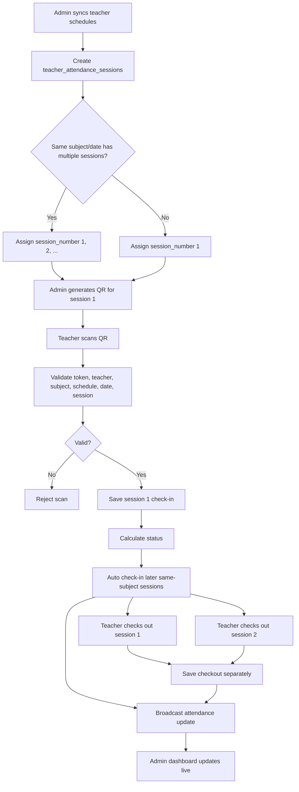
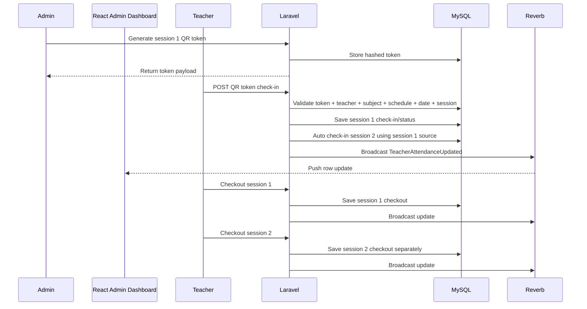

# Teacher QR Attendance Workflow

## Database Tables

- `teacher_schedules`: teacher, subject, class/group, date, start/end windows, `session_number`, status, source.
- `teacher_attendance_sessions`: one attendance row per scheduled teacher session, including `session_number`, check-in/out times, status, metrics, and `auto_check_in_source_session_id`.
- `teacher_attendance_qr_tokens`: short-lived hashed QR tokens tied to teacher, subject, schedule, date, and session number.
- `teacher_attendance_logs`: audit trail for QR check-in, auto check-in, checkout, and admin overrides.

## API Routes

- `GET /api/teacher/attendance/today`
- `POST /api/teacher/attendance/qr/check-in`
- `POST /api/teacher/attendance/sessions/{session}/check-out`
- `GET /api/teacher/attendance/required-checkouts`
- `GET /api/admin/teacher-attendance/dashboard`
- `POST /api/admin/teacher-attendance/sessions/{session}/qr-token`

## Workflow

1. Admin syncs or creates teacher schedules.
2. Each same-teacher, same-subject, same-date schedule gets a separate `session_number`.
3. Admin generates QR for session 1 only.
4. Teacher scans QR. Laravel validates token hash, expiry, teacher, subject, schedule, date, and session.
5. Laravel stores session 1 check-in and calculates `present`, `late`, `very_late`, `permission`, or `absent`.
6. Laravel auto-checks in later sessions for the same teacher, subject, and date by setting `check_in_method = auto_session`.
7. Teacher checks out from the device button for each session. Session 2 checkout is recorded separately.
8. `TeacherAttendanceUpdated` broadcasts through Reverb channels for the admin dashboard.

## Complete Workflow Diagram

## Sequence Diagram

## React Pages

- Teacher scan page: call `POST /api/teacher/attendance/qr/check-in` with `{ token, latitude, longitude }`.
- Teacher checkout page: call `GET /api/teacher/attendance/required-checkouts`, then `POST /api/teacher/attendance/sessions/{id}/check-out`.
- Admin live dashboard: call `GET /api/admin/teacher-attendance/dashboard`, subscribe with Laravel Echo to `teacher-attendance.{YYYY-MM-DD}` and listen for `.teacher.attendance.updated`.

Reverb runtime requires `BROADCAST_CONNECTION=reverb` and the Reverb server running. This repository now includes the Laravel event and broadcast config; install/configure Reverb dependencies in the environment if they are not already present.
